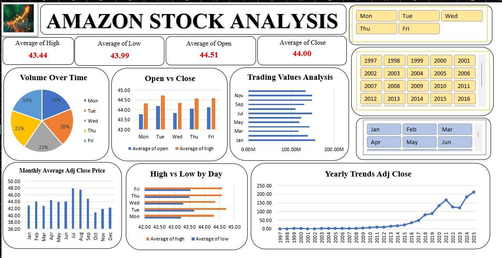

# Amazon-Stock-Analysis-Dashboard

## 📌 Overview
An interactive Excel dashboard that analyzes Amazon's historical stock performance using key stock market metrics such as Open, Close, High, Low, Volume, and Adjusted Close prices. The dashboard helps users identify trends and gain insights through dynamic visualizations.

---

## 🛠️ Tools & Technologies
- Microsoft Excel
- Pivot Tables
- Pivot Charts
- Slicers
- Data Analysis
- Data Visualization

---

## 📊 Dashboard Highlights
✔ Average Open, Close, High, and Low Prices

✔ Trading Volume Analysis

✔ Open vs Close Price Comparison

✔ High vs Low Price Analysis

✔ Monthly Average Adjusted Close Prices

✔ Yearly Stock Performance Trends

✔ Interactive Day, Month, and Year Filters

---

## 🎯 Project Objective
To transform raw Amazon stock data into meaningful visual insights that support trend analysis and better understanding of stock market performance.

---

## 📷 Dashboard Preview

---

## 📈 Key Insights
- Amazon's stock price has shown significant long-term growth.
- Trading activity remains consistent across weekdays.
- Adjusted Close prices increased substantially after 2017.
- Peak growth is visible during the 2020–2021 period.

---
